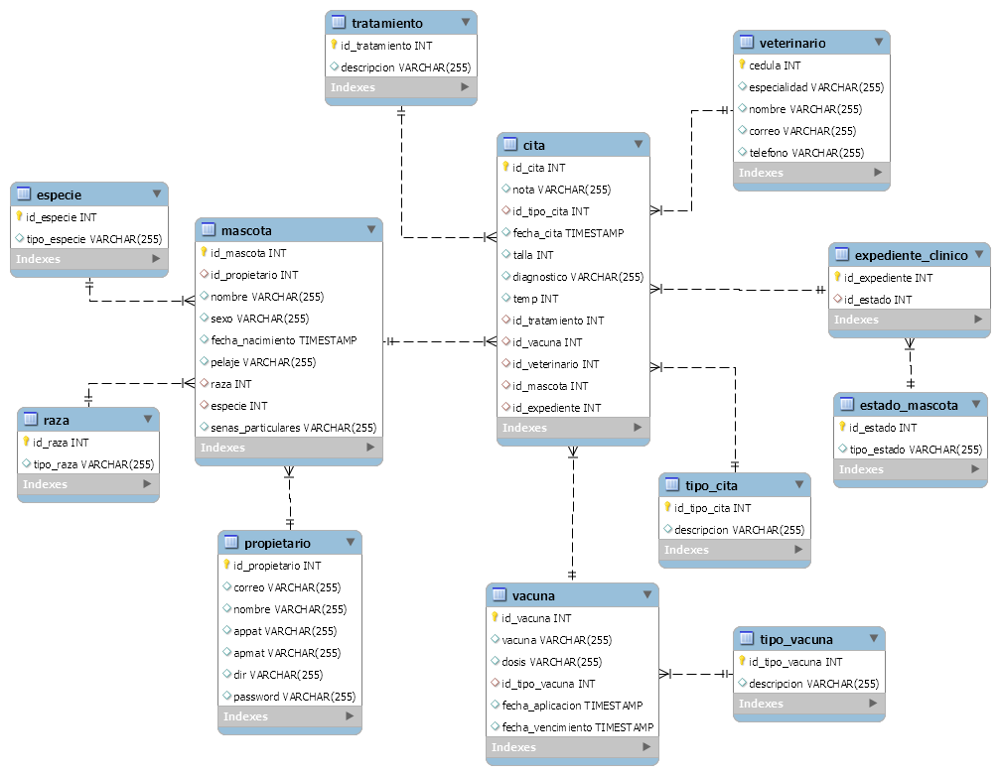

# Sistema de citas para veterinarias

Este proyecto es una aplicación web básica que permite generar citas en una veterinaria. Está desarrollado en Java utilizando las tecnologías de Servlets y JSP, y se ha probado en el entorno de desarrollo NetBeans 12 y el JDK 11.

## Diagrama de Base de Datos

## Requerimientos

* NetBeans 12 o superior
* JDK 11 o superior
* Apache Tomcat 9 o superior
* MySQL 8 o superior

Configuración

1. Clonar el repositorio.
2. Abrir NetBeans y seleccionar "Open Project".
3. Navegar hasta la carpeta donde se clonó el repositorio y seleccionar el archivo "veterinaria".
4. Configurar la conexión a la base de datos MySQL en el archivo "web/WEB-INF/web.xml".
5. Ejecutar el archivo "script.sql" ubicado en la raíz del proyecto en la base de datos.
6. Ejecutar la aplicación en NetBeans y asegurarse de que se esté utilizando el servidor Apache Tomcat configurado.

Funcionalidades

* Registro de nuevas mascotas y clientes.
* Programación de citas para las mascotas registradas.
* Visualización de citas programadas por fecha.

Estructura del proyecto

* `src/main/java/controllers`: Contiene las clases Java que implementan la lógica de la aplicación.
* `src/main/java/models`: Contiene las clases Java que representan los modelos de datos de la aplicación.
* `src/main/java/data_access_object`: Contiene las clases Java que implementan el acceso a la base de datos.
* `webapp/WEB-INF`: Contiene los archivos de configuración de la aplicación y las páginas JSP.
* `webapp/css`: Contiene los archivos CSS utilizados para estilizar las páginas JSP.
* `webapp/js`: Contiene los archivos JavaScript utilizados para implementar la funcionalidad en el cliente.
